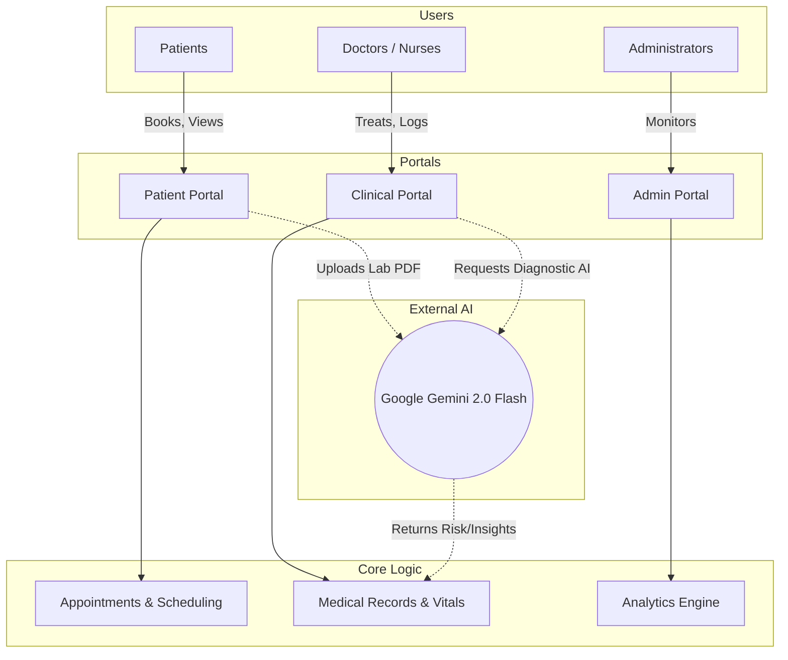

<div align="center">
  

# HealthSphere AI

> **A Next-Generation, Full-Stack AI-Powered Hospital Management & Preventive Healthcare Platform built with Django.**

</div>

HealthSphere AI is a comprehensive clinical management, patient self-service, and predictive analytics platform. It goes beyond traditional EHR systems by integrating **Google Gemini 2.0 Flash** for natural-language health reasoning, automated medical report analysis, intelligent triage, and predictive risk scoring.

---

## 🌟 Key Innovations & AI Features

HealthSphere AI is built with an AI-first approach to reduce clinical burnout and empower patients:

- **Intelligent Triage Engine:** Automatically calculates ESI (Emergency Severity Index) levels based on patient vitals and symptoms using Gemini, prioritizing critical cases immediately.
- **Diagnostic AI Assistant:** Analyzes patient history, symptoms, and vitals to provide doctors with differential diagnoses, red flags, and recommended lab tests.
- **Automated Report Analysis:** Patients can upload complex lab results (PDF/Images). The system uses Gemini to extract the data, explain the results in plain language, and alert doctors to abnormal values.
- **Predictive Risk Scoring:** Continuous monitoring of patient vitals and history to predict deterioration risks before they become critical emergencies.
- **Treatment Journey Mapping:** Visualizes a patient's entire medical history and predicts future milestones based on clinical data.

---

## 🚀 Quick Start Guide

Follow these steps to get HealthSphere AI running locally.

### 1. Prerequisites
- Python 3.10 or higher
- Git
- A Google Gemini API Key (Get one from Google AI Studio)

### 2. Clone the Repository
```bash
git clone <your-repo-url>
cd Health-Sphere/healthsphere
```

### 3. Setup Virtual Environment & Dependencies
```bash
python -m venv venv
source venv/bin/activate  # On Windows: venv\Scripts\activate
pip install -r requirements.txt
```

### 4. Environment Variables
Create a `.env` file in the `healthsphere/` root directory (next to `manage.py`):
```env
# Core Django Config
SECRET_KEY=your-secure-random-secret-key
DEBUG=True
ALLOWED_HOSTS=localhost,127.0.0.1

# AI Integration
GEMINI_API_KEY=your_gemini_api_key_here
GEMINI_MODEL=gemini-2.0-flash

# Email Configuration (Used for notifications and testing)
EMAIL_HOST_USER=your-email@gmail.com
EMAIL_HOST_PASSWORD=your-app-password
```

### 5. Database Setup & Migrations
```bash
python manage.py makemigrations
python manage.py migrate
```

### 6. Create Superuser (Admin Access)
```bash
python manage.py createsuperuser
```

### 7. Run the Server
```bash
python manage.py runserver
```

Visit: **http://127.0.0.1:8000**

### 8. Load Demo Data (Recommended)
To fully experience the platform, seed the database with 60 patients, doctors, medical records, and AI triage data:
```bash
python manage.py seed_demo_data
```

### 🔐 Demo Credentials
Once the database is seeded, you can log in using the following accounts. The password for **all** accounts is **`HealthSphere@2025`**.

| Role | Username | Example Access |
|------|----------|----------------|
| **Administrator** | `admin` | **`/admin-portal/`** (Dashboards, operations) |
| **Doctor** | `arjun.mehta` | **`/clinical/`** (Roster, Triage AI, Records) |
| **Nurse** | `anita.pillai` | **`/clinical/`** (Vitals, Treatment plans) |
| **Patient** | `rahul.gupta` | **`/patient/`** (Appointments, Lab PDF uploads) |

---

## 🏥 Platform Portals & Roles

HealthSphere AI is divided into distinct portals catering to different users:

### 1. Admin Portal (`/admin-portal/`)
**Access:** Administrators & Hospital Management
- Manage staff, doctors, and user roles.
- Oversee hospital resources, bed availability, and total admissions.
- Monitor system-wide analytics, data quality, and clinical outcomes.

### 2. Clinical Portal (`/clinical/`)
**Access:** Doctors & Nurses
- **Patient Roster:** 2xN grid views of assigned outpatients and admitted patients.
- **Treatment Plans:** Create, update, and monitor long-term patient care plans.
- **Triage Dashboard:** Live queue of emergency patients prioritized by AI.
- **Medical Records:** Add consultation notes, discharge summaries, and review diagnostic AI suggestions.

### 3. Patient Portal (`/patient/`)
**Access:** Registered Patients
- **Dashboard:** View upcoming appointments, recent records, and active treatment plans.
- **Lab Uploads:** Upload PDF lab reports and receive instant AI-powered plain-text explanations.
- **Booking System:** Schedule appointments with specific doctors based on specialty.
- **Health Journey:** View personal medical history timeline.

---

## 🛠️ Tech Stack Architecture

### System Data Flow


- **Backend Framework:** Django 4.2+ (Python 3.11+)
- **Database:** SQLite (Development) / PostgreSQL (Production Ready)
- **Artificial Intelligence:** Google Gemini API (`google-genai` SDK)
- **PDF Processing:** `pypdf` for extracting text from uploaded lab reports.
- **Frontend Design:** Custom CSS3 with dynamic Bento Grid layouts, Glassmorphism UI, and Font Awesome for iconography.
- **Analytics:** Chart.js for real-time data visualization.
- **Mailing:** Django SMTP backend configured for Gmail.

---

## 📁 Core Directory Structure

```text
Health-Sphere/
└── healthsphere/
    ├── config/            # Core settings, WSGI, ASGI, URL routing
    ├── users/             # Custom User model, RBAC, Profiles, Auth views
    ├── admin_portal/      # Layouts and logic for hospital administrators
    ├── patient_portal/    # Views for patient self-service & report uploads
    ├── clinical_portal/   # Doctor/Nurse specific workflows & treatment plans
    ├── appointments/      # Scheduling & Booking logic
    ├── analytics/         # Data aggregation for dashboard charts
    ├── ai_services/       # Integration layer for Gemini API (Triage, Diagnostics)
    ├── templates/         # Global HTML templates
    └── static/            # Static assets (CSS, JS, Fonts)
```

---

## 🛡️ Security & Privacy
- **Role-Based Access Control (RBAC):** Strict view decorators ensure patients cannot access clinical endpoints and vice-versa.
- **Environment Variables:** All sensitive keys (Secret Key, Gemini API, SMTP Passwords) are strictly loaded via `.env` using `python-dotenv`.
- **Confidential Records:** Medical records can be flagged as "Confidential", limiting access strictly to the attending physician.

---

## 📄 License

MIT © HealthSphere AI
